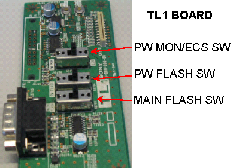
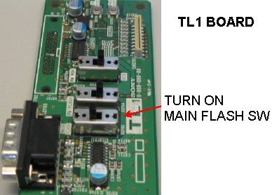
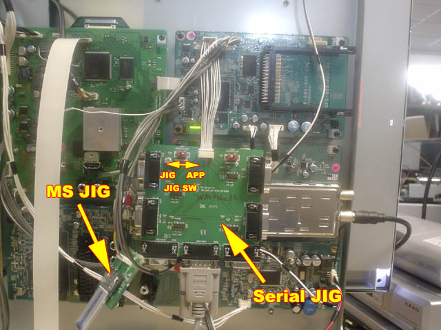
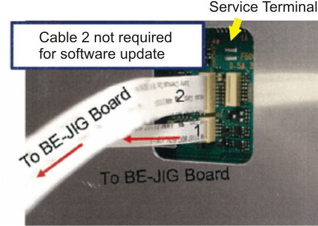
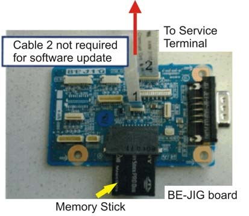
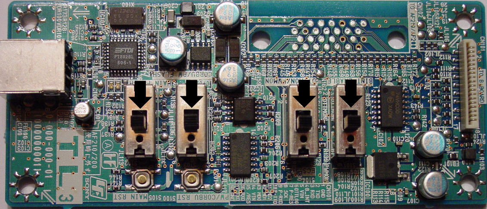
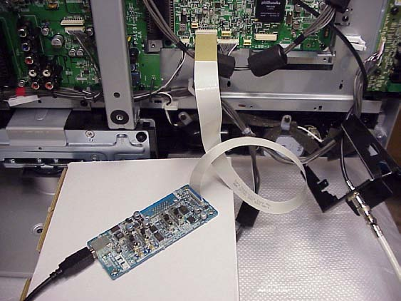
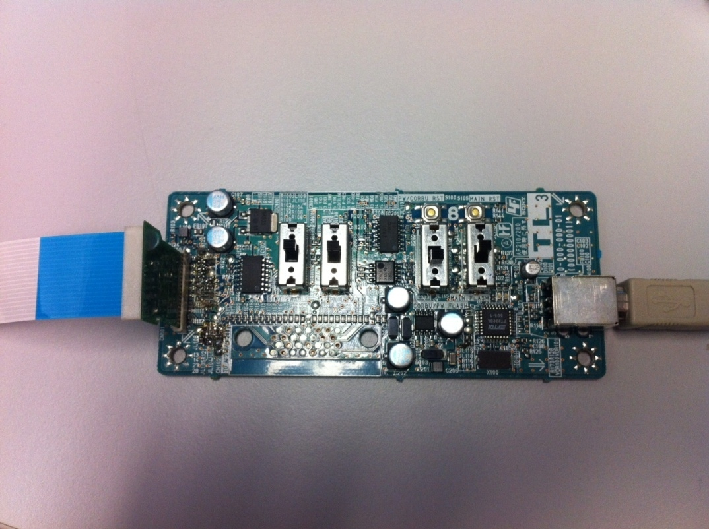
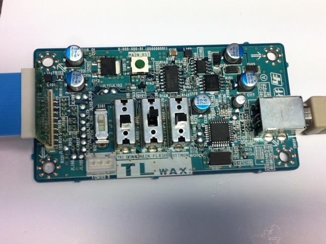
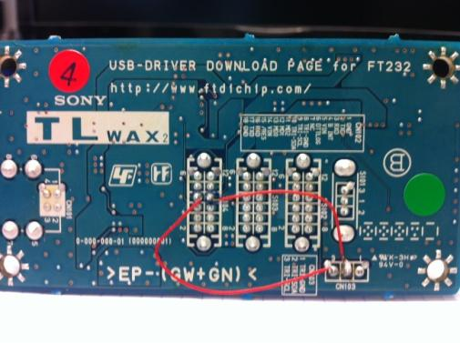

# Service JIGs

Collection of sony's Service JIGs

## TL JIG
Shown in bulletin for KLV-15SR2, KLV-17HR2, KLV-21SR2, KLV-23HR2 (?Chassis)

## FIX unk. Serial / MS JIG
Shown in update procedure for SONY KDL-40X2000 (FIX Chassis)

## BE-JIG
Shown in update procedure for the Sony XEL-1 TV (FL-1E Chassis)
> A BE-JIG is needed to perform a software upgrade, because the TV set is lacking a MS slot.

## TL-3 JIG
Shown in bulletin for AT2X chassis, and also EX2N board recovery procedure (with added adapter, p.n 994803297, and it is actually on [Amazon](https://www.amazon.de/-/en/Sony-EX2N-JIG-Adaptor-994803297/dp/B00HSHQIGS) for some reason)

Also used in AZ1N

## TL-WAX2 JIG
Shown in EX2N board recovery procedure (needs modification to work)
ALso TL-WAX2 and TL-WAX3 is used interchangably there so they are probably the same

### Rework to be applied in the back side of TL-WAX2 or TL-WAX3 board:
Add two wires to connect:
- 1: Pin3 CN103 with Pin5 S104
- 2: Pin2 CN103 with Pin11 S104

## TL-EX1 JIG
This jig is mentioned/ implemented in pretty much every tv after 2009/2010. But i have been unable to find any pictures of it sadly. The pinouts it uses are described in `uart.md`