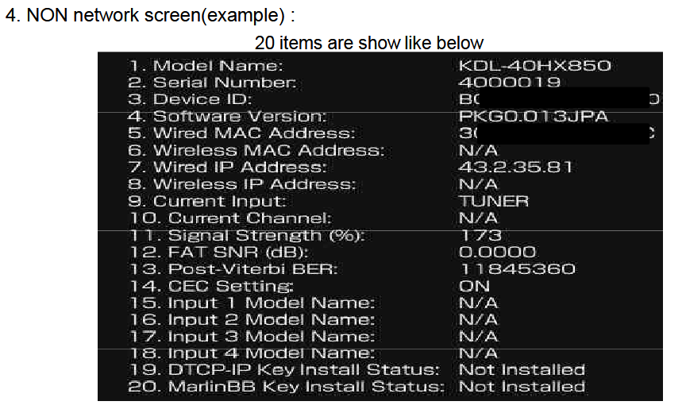

# Hidden menus

For more info refer to SM

## Service menu
While TV in standby, Press: [i+], [5], [VOL+], [POWER]

## Self diagnosis
While TV in standby, Press: [i+], [5], [VOL-], [POWER]

## "NON network screen"
- Go to Settings -> Product support -> Contact Sony/System information
- Press: [7], [6], [6], [9]
