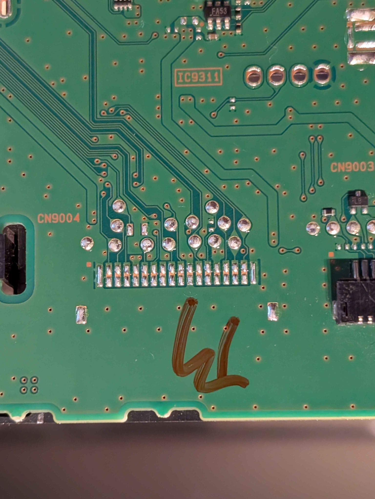
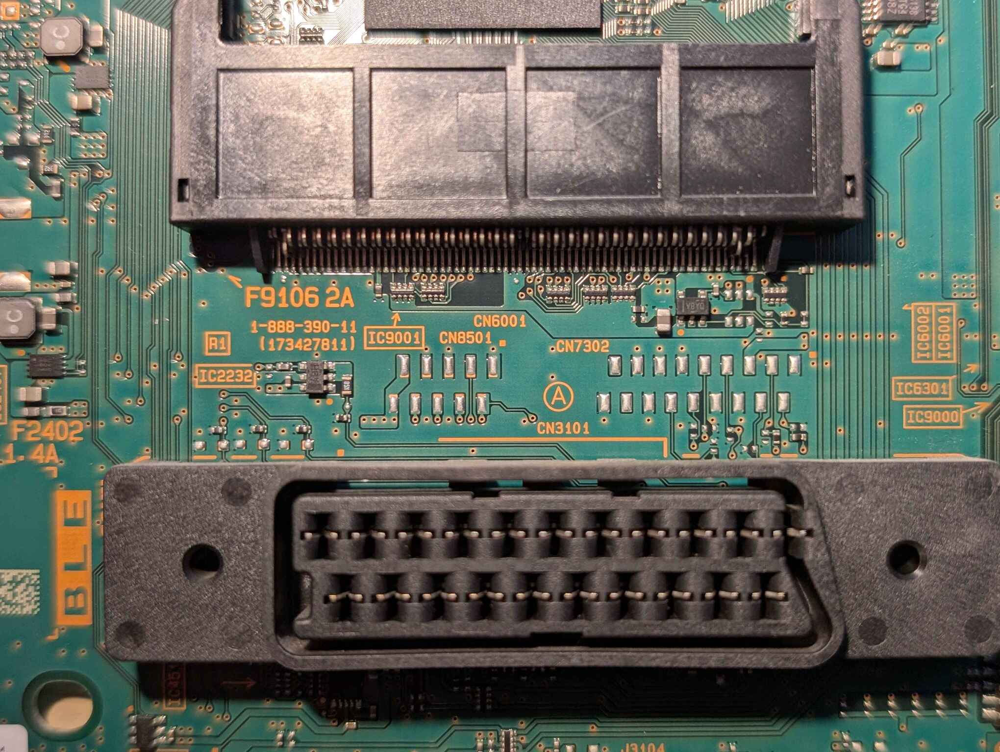

# UART

Basically all 2009/2010+ TV's use the same base UART pinout (referenced as TL-EX1 jig connector). It is located on an 18-pin debug connector, not soldered to the board. There is always 4 UART interfaces, with the main (CPU) one being on pins 7(RX) and 12(TX). The rest is related to micom/pem stuff.

On AZ1 the SoC Uart seems to be enabled and accepts SysRq interrupt (per https://acassis.wordpress.com/2014/10/08/more-sony-kdl-32ex405-logs/)

On AZ2/AZ3 wheter it is enabled it is unconfirmed.

On RB1/RB2 SoC uart seems to be disabled/quiet. 

### Specific per-chassis pinout
| pin | AZ1          | AZ2        | AZ3        | RB1/RB2    | EX2M      |
|-----|--------------|------------|------------|------------|-----------|
| 1   | GND          | GND        | GND        | GND        | GND       |
| 2   | TVM_TXD      | UARTD_TX   | UARTC_TX   | UART_3A_TX | ECS_TXD   |
| 3   | TVM_RXD      | UARTD_RX   | UARTC_RX   | UART_3A_RX | ECS_RXD   |
| 4   | RESET        | RESET      | RESET      | RESET      | TL_RESET  |
| 5   | STBY_+3.3V   | STBY_+3.3V | STBY_+3.3V | STBY_+3.3V | STBY3.3V  |
| 6   | MODE_TVM     | MODE_TVM   | MODE_TVM   | GND        | MD0       |
| 7   | DTT_RXD      | UARTA_RX   | UARTA_RX   | UART_1_RX  | UART0_RXD |
| 8   | NC(MD2)      | NC(MD2)    | NC(MD2)    | GND        | NC(MD2)   |
| 9   | PQCu/PEM_RXD | UARTC_RX   | PEM_LOG_RX | UART_2_RX  | UART2_RXD |
| 10  | PQCu/PEM_TXD | UARTC_TX   | PEM_LOG_TX | UART_2_TX  | UART2_TXD |
| 11  | GND          | GND        | GND        | GND        | GND       |
| 12  | DTT_TXD      | UARTA_TX   | UARTA_TX   | UART_1_TX  | UART0_TXD |
| 13  | ECS_MATRIX   | ECS_MATRIX | ECS_MATRIX | GND        | NC        |
| 14  | STBY_+3.3V   | STBY_+3.3V | STBY_+3.3V | GND        | STBY3.3V  |
| 15  | MODE_PEM     | MODE_PEM   | MODE_PEM   | GND        | PEM_MODE  |
| 16  | MIMAS_RXD    | PEM_LOG_RX | UART_D_RX  | UART_3B_RX | UART1_RXD |
| 17  | MIMAS_TXD    | PEM_LOG_TX | UART_D_TX  | UART_3B_TX | UART1_TXD |
| 18  | GND          | GND        | GND        | GND        | GND       |

## MS Connector
Most boards seem to also have 10pin MS(MemoryStick) connector on the board, unpopulated. This is most likely used for installing the tv's software in the factory. 

AZ3/RB2 SM mentions it as "Up date MS connector" also mentions "JIG setting", also the ABK bootloader has built-in MemoryStick support. In AZ1 release.version, never updated tv has `IMAGE_TYPE=MS-F/MS-D`, MS-F = MS factory?

On my BATL(AZ2) board this connector is actually populated.

| pin | ms      |
|-----|---------|
| 1   | GND     |
| 2   | MS_PON  |
| 3   | MS_INS  |
| 4   | MS_BS   |
| 5   | GND     |
| 6   | MS_DATA |
| 7   | GND     |
| 8   | MS_SCK  |
| 9   | VCC     |
| 10  | VCC     |

## JTAG
AZ2,AZ3,RB1,RB2 boards have a JTAG connector. It is a small 14 pin connector. Whether it works and is enabled is currently unknown. It's possible that some components related to JTAG are not populated on retail board.

## Pictures
### Debug connectors on BATL(AZ2) board (debug=CN9004) (MS=CN9003) (Side type)

### Debug connectors on BLE(RB1) board (debug=CN7302) (MS=CN8501) (Top-up type)
