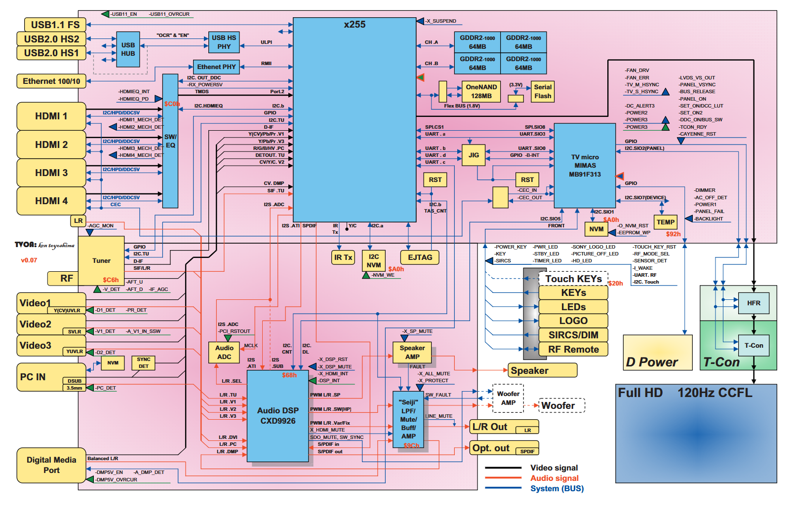

# EX2M platform (2009)

This is a America/US only platform/chassis used in   
KDL-40W5100, KDL-40W5600, KDL-40XBR9, KDL-40Z5100, KDL-40Z5600, KDL-46W5100, KDL-46W5150, KDL-46W5600, KDL-46XBR9, KDL-46Z5100, KDL-46Z5600, KDL-52W5100, KDL-52W5150, KDL-52W5600, KDL-52XBR9, KDL-52Z5100, KDL-52Z5600, KDL-65W5100, KDL-46XBR10, KDL-52XBR10

## Block diagram

## SoC
- ATI/AMD Xilleon X255
- MIPS SoC
- 256MB GDDR2 RAM

## NAND
- 128MB BGA63 OneNAND   

There is no public dumps for this model, so it is not known whether the NAND is encrypted.

## Firmware
See `firmware.md`

## Exploit
There is a root exploit avaliable for this platform - [nimue](https://github.com/CFSworks/nimue). However it was quickly patched by Sony in firmware `aa0206pf`.

There was a console on port 12345, with password "gemstar" that was used to upload and execute arbitrary code on the TV.

Notable paths from script:
- `FILESYSTEM_ROOT = '/tvgos'` (TV Guide On Screen?)
- `EMPTY_DIRECTORY = '/RW/lost+found'`
- `'cp -r /dev /widget\n'`

## OSS
Avaliable on [Internet archive](https://web.archive.org/web/20120717055235/https://products.sel.sony.com/opensource/source_tv.shtml#2009.2)

`kernel-2.6.11_gtx.tgz` is Linux kernel 2.6.11 with `CONFIG_MIPS=y` `CONFIG_ATI_XILLEON=y` `CONFIG_ATIX255=y`. It has sony `SNSC` config options.

